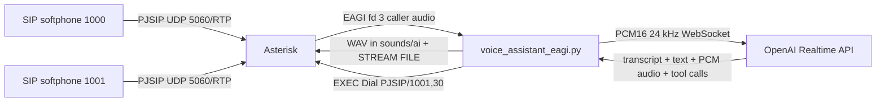

# Asterisk SIP AI Voice Assistant Prototype

This repository is a local lab prototype for an Asterisk SIP voice assistant using Python EAGI and the OpenAI Realtime API over server-side WebSocket.



## What Is Included

- PJSIP extensions `1000` and `1001`
- Dial `5000` to reach the AI assistant
- Python EAGI script that reads caller audio from file descriptor 3
- Half-duplex turn loop: capture, send to Realtime, play generated audio, repeat
- Per-call in-memory context and JSONL transcript logs
- Deterministic and model-driven transfer to extension `1001`
- Unit tests for language hints, transfer decisions, and audio conversion

## Prerequisites

- Docker and Docker Compose
- Python 3.11+ for local tests
- A SIP softphone such as MicroSIP, Linphone, or Zoiper
- An OpenAI API key with Realtime API access

## Configure OpenAI

Create `agi/.env` from the example:

```bash
cp agi/.env.example agi/.env
```

Set:

```env
OPENAI_API_KEY=your_api_key_here
OPENAI_REALTIME_MODEL=gpt-realtime
ASTERISK_EXTERNAL_IP=175.156.147.114
ASTERISK_LAN_IP=192.168.0.58
ASTERISK_LOCAL_NET=192.168.0.0/24
```

Do not commit `agi/.env`.

`ASTERISK_EXTERNAL_IP` is the public firewall/NAT address advertised to SIP trunks. `ASTERISK_LAN_IP` is the Windows/Docker host LAN address used by local softphones. `ASTERISK_LOCAL_NET` should match the LAN subnet.

## Start Asterisk

```bash
docker compose up -d --build
docker logs -f aivoicebot-asterisk
```

The Compose project builds a small local image on top of Asterisk so the Python EAGI dependencies from `agi/requirements.txt` are available inside the container.

The container mounts:

- `asterisk/*.conf` into `/etc/asterisk`
- `agi/` into `/var/lib/asterisk/agi-bin`
- generated AI audio into `/var/lib/asterisk/sounds/ai`
- call logs into `./logs`

## Register SIP Softphones

Use `ASTERISK_LAN_IP` from `agi/.env` as the SIP server for local softphones. For the public SIP/TLS trunk, Asterisk advertises `ASTERISK_EXTERNAL_IP` in SIP/RTP. The generated runtime config is created from `asterisk/pjsip.conf.template` when the container starts.

Extension `1000`:

- Username: `1000`
- Password: `1000pass`
- Domain/server: value of `ASTERISK_LAN_IP`, for example `192.168.0.58`
- Transport: UDP

Extension `1001`:

- Username: `1001`
- Password: `1001pass`
- Domain/server: value of `ASTERISK_LAN_IP`, for example `192.168.0.58`
- Transport: UDP

The concierge team number `1920` and in-room dining number `1921` are external Rainbow destinations. They do not register to this Asterisk server. The EAGI script transfers callers with Asterisk `Transfer(sip:{extension}@313.apac1.sip.openrainbow.com)`, which requests a SIP REFER/remote transfer on the inbound Rainbow call.

## Call Tests

Direct extension test:

1. Register `1000` and `1001`.
2. From `1000`, call `1001`.
3. Answer on `1001`.

AI assistant test:

1. From `1000`, call `5000`.
2. Speak after the assistant answers.
3. The EAGI loop captures one utterance, sends it to OpenAI Realtime, writes a WAV response, and plays it back.

Multilingual switching:

1. Start in English: `Hello, can you help me remember my name is Sam?`
2. Switch language: `你好，请用中文回答。`
3. Switch again to another supported language, such as Malay, Japanese, Korean, Thai, Vietnamese, Indonesian, Tamil, Mandarin, or Cantonese.
4. Check `logs/calls/{call_id}.jsonl` for language changes and transcript events.

Transfer test:

1. Call `5000` from `1000`.
2. Say `transfer me to a human`, `front desk`, or `operator`.
3. The script plays a concierge transfer phrase and runs `EXEC Transfer sip:1920@313.apac1.sip.openrainbow.com`.
4. Say `room service` or `I want in-room dining`.
5. The script plays an in-room dining transfer phrase and runs `EXEC Transfer sip:1921@313.apac1.sip.openrainbow.com`.
6. If Rainbow accepts the REFER/transfer, the caller is moved to the external target.

## Local Python Tests

```bash
python -m venv .venv
. .venv/Scripts/activate  # Windows PowerShell: .\.venv\Scripts\Activate.ps1
pip install -r agi/requirements.txt
pytest
```

## Important Configuration

`agi/.env.example`:

```env
OPENAI_API_KEY=
OPENAI_REALTIME_MODEL=gpt-realtime
ASTERISK_EXTERNAL_IP=175.156.147.114
ASTERISK_LAN_IP=192.168.0.58
ASTERISK_LOCAL_NET=192.168.0.0/24
ASTERISK_SOUNDS_DIR=/var/lib/asterisk/sounds/ai
RECORD_AUDIO=false
DEFAULT_LANGUAGE=en
SILENCE_TIMEOUT_MS=900
MAX_UTTERANCE_SECONDS=15
TRANSFER_EXTENSION=1920
HUMAN_TRANSFER_EXTENSION=1920
ROOM_SERVICE_TRANSFER_EXTENSION=1921
TRANSFER_TARGET_TEMPLATE=sip:{extension}@313.apac1.sip.openrainbow.com
LOG_LEVEL=INFO
```

Audio is not persisted by default. Set `RECORD_AUDIO=true` only in controlled testing environments.

## Troubleshooting

No SIP registration:

- Confirm Docker exposes UDP `5060`.
- Check softphone username and password.
- Verify the softphone is using UDP and the Docker host IP.
- Run `docker exec -it aivoicebot-asterisk asterisk -rx "pjsip show contacts"`.

No audio:

- Confirm UDP `20000-20099` is open between softphones and the Docker host.
- For the Rainbow SIP/TLS trunk, forward TCP `5061` and UDP `20000-20099` from `ASTERISK_EXTERNAL_IP` to `ASTERISK_LAN_IP`.
- Disable SIP ALG on routers when testing across networks.
- Try `direct_media=no` is already configured in `pjsip.conf`.

EAGI fd 3 has no audio:

- Confirm extension `5000` uses `EAGI(voice_assistant_eagi.py)`, not `AGI(...)`.
- Make sure the call is answered before EAGI runs.
- Confirm the caller is sending RTP and codec negotiation selects `ulaw`, `alaw`, or `slin16`.

OpenAI websocket connection failed:

- Check `OPENAI_API_KEY` in `agi/.env`.
- Confirm the container has outbound network access.
- Check the model in `OPENAI_REALTIME_MODEL`.
- Inspect `docker logs aivoicebot-asterisk`.

Asterisk cannot play generated audio:

- Confirm files are written under `/var/lib/asterisk/sounds/ai`.
- `STREAM FILE` must use the path without `.wav`.
- The generated WAV is mono PCM16 at 8 kHz by default.
- Check Asterisk logs for format module errors.

## Security Notes

- Change default SIP passwords before using outside a lab.
- Restrict SIP and RTP ports with a firewall.
- Never expose AGI scripts publicly.
- Protect `OPENAI_API_KEY`.
- Consider TLS/SRTP and stronger endpoint authentication for production.

## Prototype Limits

This is intentionally half-duplex and turn-based. It is suitable for validating SIP registration, EAGI audio access, Realtime API integration, multilingual context, and transfer behavior. For production, add barge-in, better RTP/media handling, structured observability, secrets management, and stricter call-flow recovery.
