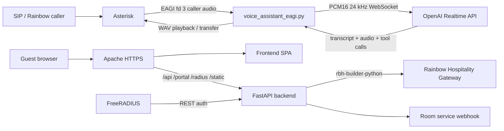

# AI Voice Bot + Rainbow Hospitality Guest App

This repository combines two Dockerized hospitality prototypes:

- An Asterisk SIP AI voice assistant using Python EAGI and the OpenAI Realtime API.
- A Rainbow Hospitality guest web app with a FastAPI backend, web frontend, Apache reverse proxy, and FreeRADIUS captive portal support.

The FastAPI backend uses `rbh-builder-python` for Rainbow Hospitality Gateway REST calls such as login, room lookup, and wake-up call creation.



## Project Structure

- `agi/`: Python EAGI assistant, OpenAI Realtime client, audio utilities, call session logic.
- `asterisk/`: Asterisk PJSIP, dialplan, RTP, and module configuration.
- `api/`: FastAPI backend for guest authentication, Rainbow config, room service proxy, wake-up calls, and captive portal auth.
- `frontend/`: Guest-facing web app built with Rollup and `rainbow-web-sdk`.
- `apache/`: Apache HTTPS reverse proxy and SPA hosting config.
- `freeradius/`: FreeRADIUS configuration for captive portal authentication.
- `tests/`: Python unit tests for voice bot logic.
- `logs/`: Runtime call logs and generated artifacts.

## Docker Services

`docker-compose.yml` defines:

- `asterisk`: SIP/RTP server and Python EAGI runtime.
- `api`: FastAPI backend for the guest web app.
- `apache`: HTTPS reverse proxy and frontend host.
- `frontend-build`: one-shot frontend build service.
- `freeradius`: RADIUS service for captive portal flows.
- `certbot`: certificate helper container.

## Prerequisites

- Docker and Docker Compose.
- Python 3.11+ for local tests.
- A SIP softphone such as MicroSIP, Linphone, or Zoiper.
- OpenAI API key with Realtime API access.
- Rainbow app credentials.
- Rainbow Hospitality Gateway credentials.

## Configure Asterisk Voice Bot

Create `agi/.env` from `agi/.env.example` and set at least:

```env
OPENAI_API_KEY=your_api_key_here
OPENAI_REALTIME_MODEL=gpt-realtime
ASTERISK_EXTERNAL_IP=<public_or_nat_ip>
ASTERISK_LAN_IP=<docker_host_lan_ip>
ASTERISK_LOCAL_NET=<lan_cidr>
```

Common voice bot settings:

```env
ASTERISK_SOUNDS_DIR=/var/lib/asterisk/sounds/ai
DEFAULT_LANGUAGE=en
SILENCE_TIMEOUT_MS=900
MAX_UTTERANCE_SECONDS=15
HUMAN_TRANSFER_EXTENSION=1920
ROOM_SERVICE_TRANSFER_EXTENSION=1921
TRANSFER_TARGET_TEMPLATE=sip:{extension}@313.apac1.sip.openrainbow.com
RECORD_AUDIO=false
LOG_LEVEL=INFO
```

Do not commit `agi/.env`.

## Configure Guest Web App

Create `api/app/.env` from `api/app/env.sample` and set:

```env
RAINBOW_SERVER=<rainbow_server>
RAINBOW_APP_ID=<application_id>
RAINBOW_APP_SECRET=<application_secret>

PMS_BASE_URL=https://red-rhg.openrainbow.io/provisioningapi
PMS_API_BASE_URL=https://red-rhg.openrainbow.io/provisioningapi/api
PMS_USERNAME=<rainbow_hospitality_username>
PMS_PASSWORD=<rainbow_hospitality_password>
PMS_TIMEOUT=10

ROOM_SERVICE_URL=<room_service_webhook_url>
ROOM_SERVICE_VERIFY=true

GUESTSERVICE_EXT=1111
FRONTDESK_EXT=0
OPERATOR_EXT=1111
CONCIERGE_EXT=0
EMERGENCY_CONTACT=1111
```

The backend validates guests by room number and last name using Rainbow Hospitality room data. Wake-up calls are created through `RainbowClient.create_wakeup_call(...)` from `rbh-builder-python`.

Do not commit `api/app/.env`.

## Start The Stack

Build the guest frontend:

```bash
docker compose --profile build run --rm frontend-build
```

Start everything:

```bash
docker compose up -d --build
```

Useful logs:

```bash
docker logs -f aivoicebot-asterisk
docker compose logs -f api
docker compose logs -f apache
```

The API is exposed on `http://localhost:8000`. Apache exposes ports `80` and `443`.

## SIP Extensions

Local test extensions:

- `1000`: password `1000pass`
- `1001`: password `1001pass`
- `5000`: AI assistant via `EAGI(voice_assistant_eagi.py)`
- `6000`: Asterisk echo test

Use `ASTERISK_LAN_IP` as the SIP server for local softphones.

Rainbow SIP/TLS trunk calls to `1900` are routed to the AI assistant. The assistant transfers callers with:

```text
Transfer(sip:{extension}@313.apac1.sip.openrainbow.com)
```

Default transfer destinations:

- `1920`: concierge / front desk / human support
- `1921`: room service / in-room dining

## Guest Web App Behavior

The frontend supports:

- Guest login by room number and last name.
- Rainbow Web SDK initialization for browser calling.
- Home, Dining, Room Service, and Others tabs.
- Call shortcuts for operator, front desk, concierge, and emergency contacts.
- Room service request proxying through `/api/flows/new-request`.
- Wake-up call scheduling through `/api/wakeup-call`.
- Captive portal page at `/portal/login`.
- RADIUS auth endpoint at `/radius/auth`.

Backend endpoints:

- `POST /api/guest/auth`
- `GET /api/rainbow/config`
- `POST /api/flows/new-request`
- `POST /api/wakeup-call`
- `GET /portal/login`
- `POST /radius/auth`

## Call Tests

Direct SIP test:

1. Register softphones `1000` and `1001`.
2. From `1000`, call `1001`.
3. Answer on `1001`.

AI assistant test:

1. From `1000`, call `5000`.
2. Speak after the assistant answers.
3. The EAGI loop captures one utterance, sends it to OpenAI Realtime, writes a WAV response, and plays it back.

Transfer test:

1. Call `5000`.
2. Say `transfer me to a human`, `front desk`, or `operator`.
3. The assistant transfers to `1920`.
4. Say `connect me to room service`.
5. The assistant transfers to `1921`.

## Local Tests

```bash
python -m venv .venv
.\.venv\Scripts\Activate.ps1
pip install -r agi/requirements.txt
python -m pytest -q
```

## Troubleshooting

### Docker Service Status

Show running services:

```bash
docker compose ps
docker compose ps -a
```

Start or restart individual services:

```bash
docker compose up -d asterisk
docker compose restart asterisk
docker compose up -d freeradius
docker compose restart freeradius
docker compose up -d api apache
```

Follow service logs:

```bash
docker logs -f aivoicebot-asterisk
docker compose logs -f asterisk
docker compose logs -f api
docker compose logs -f apache
docker compose logs -f freeradius
```

Rebuild after code or dependency changes:

```bash
docker compose up -d --build
```

### Asterisk Console And Debug

Open the Asterisk console:

```bash
docker compose exec asterisk asterisk -rvvvvv
```

Enable detailed SIP/RTP logging:

```text
pjsip set logger on
core set verbose 5
core set debug 5
rtp set debug on
```

Disable detailed logging:

```text
pjsip set logger off
rtp set debug off
core set debug 0
```

One-shot Asterisk commands:

```bash
docker compose exec asterisk asterisk -rx "pjsip show contacts"
docker compose exec asterisk asterisk -rx "pjsip show endpoints"
docker compose exec asterisk asterisk -rx "pjsip show endpoint rainbow-trunk"
docker compose exec asterisk asterisk -rx "rtp show settings"
docker compose exec asterisk asterisk -rx "dialplan reload"
docker compose exec asterisk asterisk -rx "core reload"
```

No SIP registration:

- Confirm UDP `5060` is exposed.
- Check softphone username, password, transport, and server IP.
- Run `pjsip show contacts` in the Asterisk console.
- Confirm the softphone is using the Docker host LAN IP, usually `ASTERISK_LAN_IP`.
- Check Windows Firewall rules for UDP `5060`.

No audio:

- Confirm UDP `20000-20099` is reachable.
- Verify NAT values in `agi/.env`.
- Confirm codec negotiation selects `ulaw`, `alaw`, or `slin16`.
- Use extension `6000` for an echo test.
- Turn on `rtp set debug on` and confirm `Sent RTP` and `Got RTP` lines.
- Check SDP `c=IN IP4` and `m=audio` addresses. They should advertise your reachable public/LAN IP, not the Docker container IP.

EAGI fd 3 has no audio:

- Confirm extension `5000` uses `EAGI(...)`, not `AGI(...)`.
- Confirm the call is answered before EAGI starts.
- Check RTP debug output.
- Confirm `EAGI_AUDIO_FORMAT=slin` is set before `EAGI(...)`.
- Check the call log for `no_eagi_audio`.

AGI script fails with `python3\r`:

- This means the Python script has Windows CRLF line endings.
- The repo includes `.gitattributes` to force LF for scripts.
- Convert files to LF and restart Asterisk:

```powershell
docker compose restart asterisk
```

Check the shebang inside the container:

```bash
docker compose exec asterisk sh -c "head -1 /var/lib/asterisk/agi-bin/voice_assistant_eagi.py | od -An -tx1"
```

The line should end with `0a`, not `0d 0a`.

OpenAI Realtime errors:

- Check `OPENAI_API_KEY`.
- Check `OPENAI_REALTIME_MODEL`.
- Confirm the container has outbound network access.
- For this EAGI half-duplex prototype, keep:

```env
OPENAI_REALTIME_TURN_DETECTION=manual
```

- `server_vad` is intended for true streaming media and can timeout with pre-captured EAGI chunks.
- If you see `input_audio_buffer_commit_empty`, do not mix server VAD with manual `input_audio_buffer.commit`.
- If you see `OpenAI Realtime request timed out`, check network access, API key, model access, and whether Realtime turn detection is set to `manual`.

Run local tests:

```bash
python -m pytest tests
python -m pytest tests/test_realtime_config.py
```

### Call Logs And Transcripts

Call logs are written as JSONL:

```bash
logs/calls/<call_id>.jsonl
```

Important events:

- `call_started`: caller id/name, SIP From, codec, sample rate.
- `greeting_played`: greeting WAV and AGI playback result.
- `audio_captured`: caller audio byte count.
- `language_change`: accepted language switch.
- `user`: transcription.
- `assistant`: model response text.
- `assistant_audio_played`: generated WAV playback result.
- `service_request_action_detected`: model requested hotel service submission.
- `service_request_confirmation_required`: model tried to submit before confirmation.
- `service_request_submitted`: webhook POST was attempted.
- `service_request_email_result`: service request email was attempted.
- `transfer_action_detected`: transfer tool or deterministic transfer fired.
- `transfer_result`: Asterisk `Transfer()` result and status variables.
- `transfer_reclaim_unavailable`: channel was already dead after transfer failure.
- `transcript_email_result`: transcript email was sent or skipped.

### Rainbow SIP/TLS Trunk

Show Rainbow endpoint:

```bash
docker compose exec asterisk asterisk -rx "pjsip show endpoint rainbow-trunk"
docker compose exec asterisk asterisk -rx "pjsip show aor rainbow-aor"
docker compose exec asterisk asterisk -rx "pjsip show registrations"
```

Enable SIP message logging:

```bash
docker compose exec asterisk asterisk -rx "pjsip set logger on"
docker logs -f aivoicebot-asterisk
```

Disable SIP message logging:

```bash
docker compose exec asterisk asterisk -rx "pjsip set logger off"
```

For transfer/REFER debugging, look for:

```text
REFER
Refer-To:
CSeq: ... REFER
SIP/2.0 202 Accepted
NOTIFY
Event: refer
message/sipfrag
BYE
```

Notes:

- `202 Accepted` means Rainbow accepted the REFER request.
- The real transfer outcome is usually in a later `NOTIFY` body.
- If Rainbow sends `BYE`, the original voicebot channel is gone and AGI cannot reclaim the call.
- `511 Command Not Permitted on a dead channel` means the channel is already dead.

Common transfer config:

```env
TRANSFER_TARGET_TEMPLATE=sip:{extension}@313.apac1.sip.openrainbow.com
TRANSFER_RECLAIM_ON_FAILURE=true
```

Direct room transfer examples:

- `connect me to room 1208`
- `call room 1910`
- `transfer me to 1920`

### NAT And Media

Configure NAT in `agi/.env`:

```env
ASTERISK_EXTERNAL_IP=<public_ip>
ASTERISK_LAN_IP=<windows_lan_ip>
ASTERISK_LOCAL_NET=192.168.0.0/24
```

Restart Asterisk after changing NAT values:

```bash
docker compose restart asterisk
```

Verify generated PJSIP config inside the container:

```bash
docker compose exec asterisk sh -c "grep -n 'external_\\|local_net\\|bind' /etc/asterisk/pjsip.conf"
```

### Email And Webhooks

Transcript email settings:

```env
EMAIL_TRANSCRIPT_ENABLED=true
TRANSCRIPT_EMAIL_TO=hotel@example.com
TRANSCRIPT_EMAIL_FROM=sender@example.com
EMAIL_FROM_NAME=Hotel Voicebot
SMTP_HOST=smtp.gmail.com
SMTP_PORT=587
SMTP_USERNAME=sender@example.com
SMTP_PASSWORD=<app_password>
SMTP_STARTTLS=true
```

Service request email settings:

```env
SERVICE_REQUEST_EMAIL_ENABLED=true
SERVICE_REQUEST_EMAIL_TO=
```

If `SERVICE_REQUEST_EMAIL_TO` is blank, it falls back to `TRANSCRIPT_EMAIL_TO`.

Hotel request webhook settings:

```env
HOTEL_REQUEST_WEBHOOK_URL=<webhook_url>
HOTEL_REQUEST_WEBHOOK_TOKEN=<optional_bearer_token>
HOTEL_REQUEST_WEBHOOK_TIMEOUT_SECONDS=8
```

Rainbow Node SDK bubble notification settings:

```env
RAINBOW_NODE_NOTIFICATIONS_ENABLED=true
RAINBOW_HOST=official
RAINBOW_MODE=xmpp
RAINBOW_LOGIN=<rainbow_bot_login>
RAINBOW_PASSWORD=<rainbow_bot_password>
RAINBOW_APP_ID=<rainbow_application_id>
RAINBOW_APP_SECRET=<rainbow_application_secret>
RAINBOW_FRONT_DESK_BUBBLE_JID=<front_desk_bubble_jid>
RAINBOW_ROOM_SERVICE_BUBBLE_JID=<room_service_bubble_jid>
RAINBOW_ROOM_SERVICE_CATEGORIES=room_service,housekeeping
RAINBOW_NODE_ASYNC=true
RAINBOW_NODE_TIMEOUT_SECONDS=45
RAINBOW_NODE_READY_TIMEOUT_MS=30000
RAINBOW_NODE_STOP_TIMEOUT_MS=5000
```

When a confirmed OpenAI `submit_hotel_request` action is received, the voicebot submits to `HOTEL_REQUEST_WEBHOOK_URL` and queues a Rainbow bubble message. With `RAINBOW_NODE_ASYNC=true`, Rainbow delivery does not block the live phone call; the call log first records `service_request_rainbow_queued`, then records `service_request_rainbow_result` if the notifier finishes while the EAGI process is still running. `room_service` and `housekeeping` requests go to `RAINBOW_ROOM_SERVICE_BUBBLE_JID`; all other categories go to `RAINBOW_FRONT_DESK_BUBBLE_JID` unless `RAINBOW_ROOM_SERVICE_CATEGORIES` is expanded.

Check call logs for:

- `service_request_submitted`
- `service_request_rainbow_queued`
- `service_request_rainbow_result`
- `service_request_email_result`
- `transcript_email_result`
- `transcript_email_error`

### Guest Web App And API

API health/logs:

```bash
docker compose logs -f api
curl http://localhost:8000/docs
```

Apache logs:

```bash
docker compose logs -f apache
```

Rebuild frontend:

```bash
docker compose --profile build run --rm frontend-build
docker compose restart apache
```

Guest web app auth errors:

- Check `api/app/.env`.
- Confirm `PMS_API_BASE_URL` points to the `/api` base path.
- Confirm Rainbow Hospitality credentials can call `/Login` and `/GetRooms`.
- Check `docker compose logs -f api`.

### FreeRADIUS

Start FreeRADIUS:

```bash
docker compose up -d freeradius
docker compose ps freeradius
```

Expected port binding:

```text
0.0.0.0:1812-1813->1812-1813/udp
[::]:1812-1813->1812-1813/udp
```

Follow logs:

```bash
docker compose logs -f freeradius
```

Run FreeRADIUS in debug mode:

```bash
docker compose stop freeradius
docker compose run --rm --service-ports --entrypoint sh freeradius -c "cp -a /config-src/. /etc/freeradius/ && chmod -R go-w /etc/freeradius && freeradius -X"
```

Stop debug mode with `Ctrl+C`, then restart normal service:

```bash
docker compose up -d freeradius
```

Why config is copied at startup:

- Windows bind mounts can appear globally writable in Linux containers.
- FreeRADIUS refuses to start if `/etc/freeradius` is globally writable.
- The Compose service mounts config at `/config-src`, copies it into `/etc/freeradius`, then runs `chmod -R go-w`.

Check whether FreeRADIUS is bound:

```bash
docker compose ps freeradius
docker inspect aivoicebot-freeradius-1 --format "{{json .HostConfig.PortBindings}}"
docker inspect aivoicebot-freeradius-1 --format "{{json .NetworkSettings.Ports}}"
```

Internal radclient test from PowerShell:

```powershell
@'
User-Name = "1910"
User-Password = "Yip"
NAS-IP-Address = 127.0.0.1
Message-Authenticator = 0x00
'@ | docker compose exec -T freeradius radclient -x 127.0.0.1:1812 auth testing123
```

Expected network success may still be `Access-Reject`:

```text
Sent Access-Request ...
Received Access-Reject ...
```

`Access-Reject` means the packet reached FreeRADIUS and auth policy rejected it.

Test from Windows host without local `radclient`:

```powershell
@'
User-Name = "1910"
User-Password = "Yip"
NAS-IP-Address = 127.0.0.1
Message-Authenticator = 0x00
'@ | docker run --rm -i freeradius/freeradius-server radclient -x host.docker.internal:1812 auth testing123
```

If using another machine, send to the Windows host IP and allow inbound Windows Firewall rules:

```text
UDP 1812
UDP 1813
```

Common FreeRADIUS problems:

- `Configuration directory /etc/freeradius is globally writable`: use the Compose copy-and-chmod command.
- `port is already allocated`: remove old debug/run containers using `docker ps` and `docker rm -f <container>`.
- No packets in logs: confirm the service is running, ports are published, and Windows Firewall allows UDP `1812`.
- `Access-Reject`: networking works; check users, API `/radius/auth`, shared secret, and request attributes.

## Security Notes

- Change default SIP passwords before using outside a lab.
- Restrict SIP, RTP, HTTP, HTTPS, and RADIUS ports with a firewall.
- Never expose AGI scripts publicly.
- Protect `OPENAI_API_KEY`, Rainbow credentials, SMTP credentials, and webhook tokens.
- Keep `agi/.env` and `api/app/.env` out of Git.
- Review frontend dependency audit results before production deployment.

## Prototype Limits

The voice assistant is intentionally half-duplex and turn-based. It is suitable for validating SIP registration, EAGI audio capture, OpenAI Realtime integration, multilingual handling, service request submission, and transfer behavior.

For production, add barge-in, stronger media handling, structured observability, secret management, stricter call recovery, dependency hardening, and production-grade certificate management.
