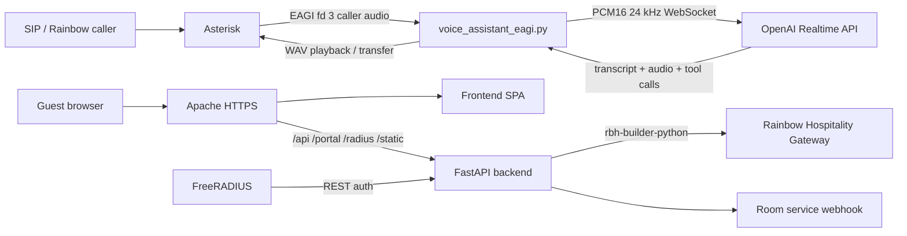

# AI Voice Bot + Rainbow Hospitality Guest App

This repository combines two Dockerized hospitality prototypes:

- An Asterisk SIP AI voice assistant using Python EAGI and the OpenAI Realtime API.
- A Rainbow Hospitality guest web app with a FastAPI backend, web frontend, Apache reverse proxy, and FreeRADIUS captive portal support.

The FastAPI backend uses `rbh-builder-python` for Rainbow Hospitality Gateway REST calls such as login, room lookup, and wake-up call creation.



## Project Structure

- `agi/`: Python EAGI assistant, OpenAI Realtime client, audio utilities, call session logic.
- `asterisk/`: Asterisk PJSIP, dialplan, RTP, and module configuration.
- `api/`: FastAPI backend for guest authentication, Rainbow config, room service proxy, wake-up calls, and captive portal auth.
- `frontend/`: Guest-facing web app built with Rollup and `rainbow-web-sdk`.
- `apache/`: Apache HTTPS reverse proxy and SPA hosting config.
- `freeradius/`: FreeRADIUS configuration for captive portal authentication.
- `tests/`: Python unit tests for voice bot logic.
- `logs/`: Runtime call logs and generated artifacts.

## Docker Services

`docker-compose.yml` defines:

- `asterisk`: SIP/RTP server and Python EAGI runtime.
- `api`: FastAPI backend for the guest web app.
- `apache`: HTTPS reverse proxy and frontend host.
- `frontend-build`: one-shot frontend build service.
- `freeradius`: RADIUS service for captive portal flows.
- `certbot`: certificate helper container.

## Prerequisites

- Docker and Docker Compose.
- Python 3.11+ for local tests.
- A SIP softphone such as MicroSIP, Linphone, or Zoiper.
- OpenAI API key with Realtime API access.
- Rainbow app credentials.
- Rainbow Hospitality Gateway credentials.

## Configure Asterisk Voice Bot

Create `agi/.env` from `agi/.env.example` and set at least:

```env
OPENAI_API_KEY=your_api_key_here
OPENAI_REALTIME_MODEL=gpt-realtime
ASTERISK_EXTERNAL_IP=<public_or_nat_ip>
ASTERISK_LAN_IP=<docker_host_lan_ip>
ASTERISK_LOCAL_NET=<lan_cidr>
```

Common voice bot settings:

```env
ASTERISK_SOUNDS_DIR=/var/lib/asterisk/sounds/ai
DEFAULT_LANGUAGE=en
SILENCE_TIMEOUT_MS=900
MAX_UTTERANCE_SECONDS=15
HUMAN_TRANSFER_EXTENSION=1920
ROOM_SERVICE_TRANSFER_EXTENSION=1921
TRANSFER_TARGET_TEMPLATE=sip:{extension}@313.apac1.sip.openrainbow.com
RECORD_AUDIO=false
LOG_LEVEL=INFO
```

Do not commit `agi/.env`.

## Configure Guest Web App

Create `api/app/.env` from `api/app/env.sample` and set:

```env
RAINBOW_SERVER=<rainbow_server>
RAINBOW_APP_ID=<application_id>
RAINBOW_APP_SECRET=<application_secret>

PMS_BASE_URL=https://red-rhg.openrainbow.io/provisioningapi
PMS_API_BASE_URL=https://red-rhg.openrainbow.io/provisioningapi/api
PMS_USERNAME=<rainbow_hospitality_username>
PMS_PASSWORD=<rainbow_hospitality_password>
PMS_TIMEOUT=10

ROOM_SERVICE_URL=<room_service_webhook_url>
ROOM_SERVICE_VERIFY=true

GUESTSERVICE_EXT=1111
FRONTDESK_EXT=0
OPERATOR_EXT=1111
CONCIERGE_EXT=0
EMERGENCY_CONTACT=1111
```

The backend validates guests by room number and last name using Rainbow Hospitality room data. Wake-up calls are created through `RainbowClient.create_wakeup_call(...)` from `rbh-builder-python`.

Do not commit `api/app/.env`.

## Start The Stack

Build the guest frontend:

```bash
docker compose --profile build run --rm frontend-build
```

Start everything:

```bash
docker compose up -d --build
```

Useful logs:

```bash
docker logs -f aivoicebot-asterisk
docker compose logs -f api
docker compose logs -f apache
```

The API is exposed on `http://localhost:8000`. Apache exposes ports `80` and `443`.

## SIP Extensions

Local test extensions:

- `1000`: password `1000pass`
- `1001`: password `1001pass`
- `5000`: AI assistant via `EAGI(voice_assistant_eagi.py)`
- `6000`: Asterisk echo test

Use `ASTERISK_LAN_IP` as the SIP server for local softphones.

Rainbow SIP/TLS trunk calls to `1900` are routed to the AI assistant. The assistant transfers callers with:

```text
Transfer(sip:{extension}@313.apac1.sip.openrainbow.com)
```

Default transfer destinations:

- `1920`: concierge / front desk / human support
- `1921`: room service / in-room dining

## Guest Web App Behavior

The frontend supports:

- Guest login by room number and last name.
- Rainbow Web SDK initialization for browser calling.
- Home, Dining, Room Service, and Others tabs.
- Call shortcuts for operator, front desk, concierge, and emergency contacts.
- Room service request proxying through `/api/flows/new-request`.
- Wake-up call scheduling through `/api/wakeup-call`.
- Captive portal page at `/portal/login`.
- RADIUS auth endpoint at `/radius/auth`.

Backend endpoints:

- `POST /api/guest/auth`
- `GET /api/rainbow/config`
- `POST /api/flows/new-request`
- `POST /api/wakeup-call`
- `GET /portal/login`
- `POST /radius/auth`

## Call Tests

Direct SIP test:

1. Register softphones `1000` and `1001`.
2. From `1000`, call `1001`.
3. Answer on `1001`.

AI assistant test:

1. From `1000`, call `5000`.
2. Speak after the assistant answers.
3. The EAGI loop captures one utterance, sends it to OpenAI Realtime, writes a WAV response, and plays it back.

Transfer test:

1. Call `5000`.
2. Say `transfer me to a human`, `front desk`, or `operator`.
3. The assistant transfers to `1920`.
4. Say `connect me to room service`.
5. The assistant transfers to `1921`.

## Local Tests

```bash
python -m venv .venv
.\.venv\Scripts\Activate.ps1
pip install -r agi/requirements.txt
python -m pytest -q
```

## Troubleshooting

Open the Asterisk console:

```bash
docker compose exec asterisk asterisk -rvvvvv
```

Enable detailed SIP/RTP logging:

```text
pjsip set logger on
core set verbose 5
core set debug 5
rtp set debug on
```

Disable detailed logging:

```text
pjsip set logger off
rtp set debug off
core set debug 0
```

No SIP registration:

- Confirm UDP `5060` is exposed.
- Check softphone username, password, transport, and server IP.
- Run `pjsip show contacts` in the Asterisk console.

No audio:

- Confirm UDP `20000-20099` is reachable.
- Verify NAT values in `agi/.env`.
- Confirm codec negotiation selects `ulaw`, `alaw`, or `slin16`.
- Use extension `6000` for an echo test.

EAGI fd 3 has no audio:

- Confirm extension `5000` uses `EAGI(...)`, not `AGI(...)`.
- Confirm the call is answered before EAGI starts.
- Check RTP debug output.

OpenAI Realtime errors:

- Check `OPENAI_API_KEY`.
- Check `OPENAI_REALTIME_MODEL`.
- Confirm the container has outbound network access.

Guest web app auth errors:

- Check `api/app/.env`.
- Confirm `PMS_API_BASE_URL` points to the `/api` base path.
- Confirm Rainbow Hospitality credentials can call `/Login` and `/GetRooms`.
- Check `docker compose logs -f api`.

## Security Notes

- Change default SIP passwords before using outside a lab.
- Restrict SIP, RTP, HTTP, HTTPS, and RADIUS ports with a firewall.
- Never expose AGI scripts publicly.
- Protect `OPENAI_API_KEY`, Rainbow credentials, SMTP credentials, and webhook tokens.
- Keep `agi/.env` and `api/app/.env` out of Git.
- Review frontend dependency audit results before production deployment.

## Prototype Limits

The voice assistant is intentionally half-duplex and turn-based. It is suitable for validating SIP registration, EAGI audio capture, OpenAI Realtime integration, multilingual handling, service request submission, and transfer behavior.

For production, add barge-in, stronger media handling, structured observability, secret management, stricter call recovery, dependency hardening, and production-grade certificate management.
